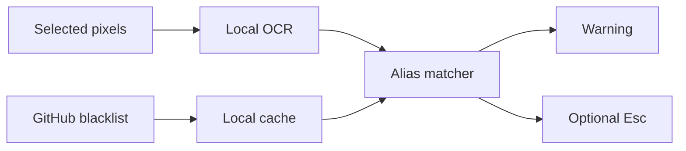

# CrossOff Lobby Dodger

[](https://github.com/kaankutluturk/crossoff-lobby-dodger/actions/workflows/ci.yml)

CrossOff Lobby Dodger is a small Windows companion that watches a user-selected part of the screen, runs OCR locally, and compares recognized lobby names with a staff-reviewed blacklist stored in this repository.

When an active entry is detected twice in consecutive scans, the client:

- shows a warning with the matched alias, group, reason, and evidence link; and
- optionally sends one `Esc` key press to the foreground Dead by Daylight window.

Automatic dodging is enabled by default and can be disabled in the client. In manual mode the warning still appears, but the program never presses a key.

## What it does—and does not do

The client uses ordinary Windows screen capture and synthetic keyboard input. It does **not** open the Dead by Daylight process, inspect or modify game memory, inject a DLL, install a driver, read network traffic, or access game files. OCR stays on the local PC; screenshots and recognized names are not uploaded or written to logs.

This design minimizes interaction with the game, but no third-party developer can guarantee that an anti-cheat or the game's rules will always permit a companion application. Users run it at their own risk. The source is public so its behavior can be reviewed.

## Download and use

1. Download `CrossOffLobbyDodger-win-x64.zip` from the latest GitHub release.
2. Extract the entire ZIP. Do not run the executable from inside the archive.
3. Start `CrossOffLobbyDodger.exe`.
4. Select the rectangular screen area containing the survivor names in the killer lobby.
5. Use **Test OCR** to confirm the names are readable.
6. Leave **Automatically press Esc** enabled for automatic dodging, or disable it for warnings only.
7. Press **Start monitoring** and return to Dead by Daylight.

Borderless or windowed display mode is recommended because ordinary screen capture may return a black image for some exclusive-fullscreen configurations.

The capture rectangle is stored locally in `%LocalAppData%\CrossOffLobbyDodger\settings.json`. If the game resolution, monitor, or UI scale changes, select the area again.

## Blacklist

The live list is [`blacklist/blacklist.json`](blacklist/blacklist.json). It starts empty intentionally. Only entries with `"active": true` are matched.

Anyone may propose an entry by opening a **Blacklist submission** issue and attaching evidence. A maintainer reviews it before changing the live JSON. Direct, unreviewed additions should not be merged.

Each entry has:

| Field         | Meaning                                     |
| ------------- | ------------------------------------------- |
| `id`          | Stable, unique record identifier            |
| `group`       | SWF/community label shown in warnings       |
| `aliases`     | Exact player-name aliases recognized by OCR |
| `reason`      | Short, factual reason shown to users        |
| `evidenceUrl` | Maintainer-reviewed supporting evidence     |
| `addedAt`     | UTC date the entry was approved             |
| `active`      | Whether clients should match the entry      |

Player names are not stable identities: they can be changed, duplicated, or imitated with similar Unicode characters. A match therefore means only that the visible text matched an approved alias; it does not prove the current lobby is grouped or that the person is the original account owner.

The initial build ships the English OCR model. Latin names and common symbols are the primary target; aliases written entirely in other scripts may require additional Tesseract language data in a future release.

## Build

Requirements:

- Windows 10 or later
- .NET 10 SDK
- Visual C++ 2015–2022 x64 runtime (required by the OCR engine)

```powershell
pwsh scripts/Get-Tessdata.ps1
dotnet restore CrossOffLobbyDodger.sln
dotnet build CrossOffLobbyDodger.sln -c Release
dotnet run --project tests/CrossOffLobbyDodger.SelfTest/CrossOffLobbyDodger.SelfTest.csproj -c Release
dotnet publish src/CrossOffLobbyDodger.Client/CrossOffLobbyDodger.Client.csproj -c Release -r win-x64 --self-contained true -o publish
```

The model download script pins Tesseract's English `tessdata_fast` 4.1.0 file and verifies its SHA-256 checksum before placing it in the project.

GitHub Actions builds every change. Pushing a tag such as `v0.1.0` creates a release ZIP and SHA-256 checksum.

## Data flow



## Moderation

See [CONTRIBUTING.md](CONTRIBUTING.md). Blacklist changes should be factual, evidence-backed, appealable, and reviewed by someone other than the submitter whenever possible.

## License

The application source is released under the MIT License. TesseractOCR and the bundled English OCR language data are Apache-2.0 components; see [THIRD_PARTY_NOTICES.md](THIRD_PARTY_NOTICES.md).
