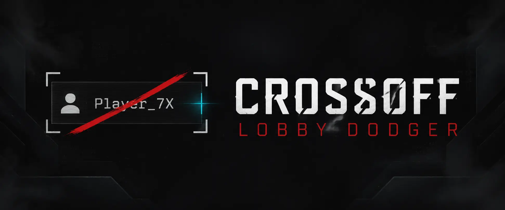
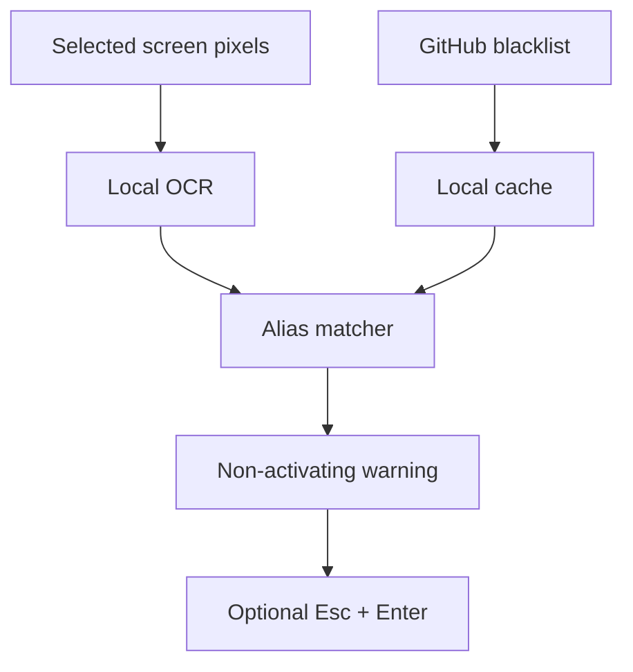

<p align="center">
  
</p>

<p align="center">
  <a href="https://github.com/kaankutluturk/crossoff-lobby-dodger/actions/workflows/ci.yml"></a>
  <a href="https://github.com/kaankutluturk/crossoff-lobby-dodger/releases/latest"></a>
  <a href="https://github.com/kaankutluturk/crossoff-lobby-dodger/releases"></a>
  <a href="LICENSE"></a>
  
</p>

<p align="center">
  <strong>Spot the name. Get the warning. Dodge the lobby.</strong><br>
  A transparent, screen-only lobby companion with local OCR and a staff-reviewed blacklist.
</p>

<p align="center">
  <a href="https://github.com/kaankutluturk/crossoff-lobby-dodger/releases/latest"><strong>Download for Windows</strong></a>
  ·
  <a href="blacklist/blacklist.json">View the live blacklist</a>
  ·
  <a href="https://github.com/kaankutluturk/crossoff-lobby-dodger/issues/new?template=blacklist-submission.yml">Submit evidence</a>
</p>

## At a glance

| Local OCR                                                                                  | Reviewed blacklist                                                                          | Two dodge modes                                                                                    |
| ------------------------------------------------------------------------------------------ | ------------------------------------------------------------------------------------------- | -------------------------------------------------------------------------------------------------- |
| Reads only the screen area you select. Screenshots and recognized names remain on your PC. | Downloads the public, versioned list from this repository and keeps a local fallback cache. | Warn only in manual mode, or show the alert and confirm the normal lobby-leave flow automatically. |

CrossOff Lobby Dodger watches the visible player-name area, recognizes the text locally, and compares it with active aliases in the blacklist. A name must match in consecutive scans before the client reacts.

## Quick start

1. Download **CrossOffLobbyDodger-win-x64.zip** from the [latest release](https://github.com/kaankutluturk/crossoff-lobby-dodger/releases/latest).
2. Extract the complete ZIP. Do not launch the executable from inside the archive.
3. Start **CrossOffLobbyDodger.exe**.
4. Select the rectangular screen area containing the visible lobby player names.
5. Use **Test OCR** and confirm that the names are readable.
6. Choose automatic lobby leaving or manual warnings.
7. Start monitoring and return to Dead by Daylight.

> [!TIP]
> Borderless or windowed display mode is recommended. Ordinary screen capture may return a black image in some exclusive-fullscreen configurations.

The capture rectangle and preferences are stored locally in `%LocalAppData%\CrossOffLobbyDodger\settings.json`. Select the area again after changing resolution, monitor arrangement, or UI scale.

## Match behavior

| Mode          | Confirmed blacklist match                                                                                                                                         |
| ------------- | ----------------------------------------------------------------------------------------------------------------------------------------------------------------- |
| **Automatic** | Shows a non-activating warning, waits briefly, sends `Esc`, waits 400 ms, verifies that DBD still has focus, sends `Enter`, then reports the result in the alert. |
| **Manual**    | Shows the same alias, group, reason, and evidence warning but never sends keyboard input.                                                                         |

Automatic mode uses the standard keyboard-driven lobby-leave confirmation. It is role-neutral and works from the same OCR match path in killer and survivor lobbies.

## Privacy boundary

| The client does                                                    | The client does not                                 |
| ------------------------------------------------------------------ | --------------------------------------------------- |
| Capture a user-selected screen rectangle                           | Open or attach to the Dead by Daylight process      |
| Run OCR locally with the bundled English model                     | Read or write game memory                           |
| Download the public blacklist over HTTPS                           | Inject a DLL or install a driver                    |
| Send `Esc` and `Enter` through standard Windows input when enabled | Read game files or network traffic                  |
| Cache settings and the last valid blacklist locally                | Upload screenshots, OCR output, or recognized names |

This design minimizes interaction with the game, but no third-party developer can guarantee that an anti-cheat system or the game's rules will always permit a companion application. Users run it at their own risk; the complete source is public for review.

## Blacklist and moderation

The current backend is the versioned [`blacklist/blacklist.json`](blacklist/blacklist.json) file. It starts empty intentionally, and only entries with `"active": true` are matched.

Anyone can open a **Blacklist submission** issue with photo or video evidence. A maintainer reviews the submission before changing the live feed. Direct, unreviewed additions should not be merged.

| Field         | Meaning                                       |
| ------------- | --------------------------------------------- |
| `id`          | Stable, unique record identifier              |
| `group`       | SWF/community label displayed in warnings     |
| `aliases`     | Visible player-name aliases recognized by OCR |
| `reason`      | Short, factual reason displayed to users      |
| `evidenceUrl` | Maintainer-reviewed supporting evidence       |
| `addedAt`     | UTC date the record was approved              |
| `active`      | Whether clients should match the record       |

Player names are not permanent identities: they can be changed, duplicated, or imitated with similar Unicode characters. A match means only that the visible text matched an approved alias. It does not prove the current lobby is grouped or that the player is the original account owner.

The initial build includes the English OCR model. Latin names and common symbols are the primary target.

## Architecture



## Roadmap

- [ ] Discord submission and staff-review backend
- [ ] Automatic synchronization from approved Discord cases to the public GitHub feed
- [ ] Authenticode signing for release executables
- [ ] Field-tested OCR presets and additional language models
- [ ] Further application UI and tray-mode polish

## Build from source

Requirements:

- Windows 10 or later
- .NET 10 SDK
- Visual C++ 2015–2022 x64 runtime for the OCR engine

```powershell
pwsh scripts/Get-Tessdata.ps1
dotnet restore CrossOffLobbyDodger.sln
dotnet build CrossOffLobbyDodger.sln -c Release
dotnet run --project tests/CrossOffLobbyDodger.SelfTest/CrossOffLobbyDodger.SelfTest.csproj -c Release
dotnet publish src/CrossOffLobbyDodger.Client/CrossOffLobbyDodger.Client.csproj -c Release -r win-x64 --self-contained true -o publish
```

The model downloader pins Tesseract's English `tessdata_fast` 4.1.0 file and verifies its SHA-256 checksum. GitHub Actions builds, tests, and publishes an artifact for every change. Pushing a `v*` tag or updating [`.github/RELEASE_VERSION`](.github/RELEASE_VERSION) creates a release ZIP and checksum.

## Contributing

See [CONTRIBUTING.md](CONTRIBUTING.md) before proposing code or blacklist changes. Records should be factual, evidence-backed, appealable, and reviewed by someone other than the submitter whenever possible.

## License

The application source is released under the [MIT License](LICENSE). TesseractOCR and the bundled English OCR language data are Apache-2.0 components; see [THIRD_PARTY_NOTICES.md](THIRD_PARTY_NOTICES.md).
